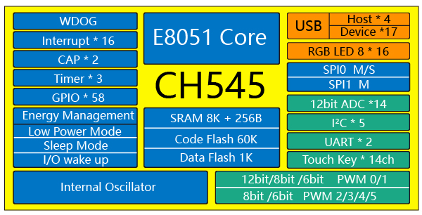
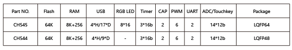

# [CH545](https://www.soc.xin/CH545)

* [WCH](http://www.wch.cn/)：[MCS-51](https://github.com/SoCXin/MCS-51)
* [L1R3](https://github.com/SoCXin/Level)：48 MHz

## [简介](https://www.soc.xin/CH545)

[CH545](http://www.wch.cn/products/CH545.html) 兼容MCS51的增强型E8051内核，79%指令是单字节单周期指令，3KB BootLoader + 60KB CodeFlash，8K xRAM + 256B iRAM。

CH545内嵌USB主机控制器和收发器，内置4端口USB root-hub根集线器，支持USB Host主机模式和USB Device 设备模式，支持USB 2.0全速12Mpbs或者低速1.5Mbps；内嵌4通道全速复合USB设备控制器和收发器，每个复合USB设备控制器包括一个device-hub和三个功能子设备。支持最大64字节数据包，内置FIFO，支持DMA。
CH545提供丰富的接口资源，包括2组异步串口、6路PWM、14通道电容触摸按键、1组IIC主机、4组IIC从机、128组RGB三色LED控制器，其他包括2路SPI、14路12位ADC，支持电压比较；内置3组定时器和2路信号捕捉；支持最多58个GPIO。

### 关键参数

* 48 MHz MCS-51 Core
* 256B IRAM + 8KB xRAM + 60KB FLASH
* 内置4端口root-hub根集线器,支持USB 2.0全速,支持DMA；
* 内嵌4通道全速复合USB设备控制器和收发器，每个复合设备包括1个device-hub和3个功能子设备，支持4组USB主机，或17组USB从机；
* LED驱动器支持384只单色LED,或128组RGB三色LED；
* UART x 2 + SPI x 2；
* IIC主机 x1 + IIC从机 x4；
* 14通道12位ADC；
* 封装(LQFP48/LQFP64)

## [资源收录](https://github.com/SoCXin)

* [参考资源](src/)
* [参考文档](docs/)
* [参考工程](project/)

## [选型建议](https://github.com/SoCXin)

[CH545](https://github.com/SoCXin/CH545)主要用于USB HUB类产品，可用于支持多USB设备连接。

简化版[CH544](http://www.wch.cn/products/CH544.html)去掉了RGB三色LED的PWM模块，仅提供2通道复合USB设备控制器和3组IIC。

* LQFP48
* LQFP64

